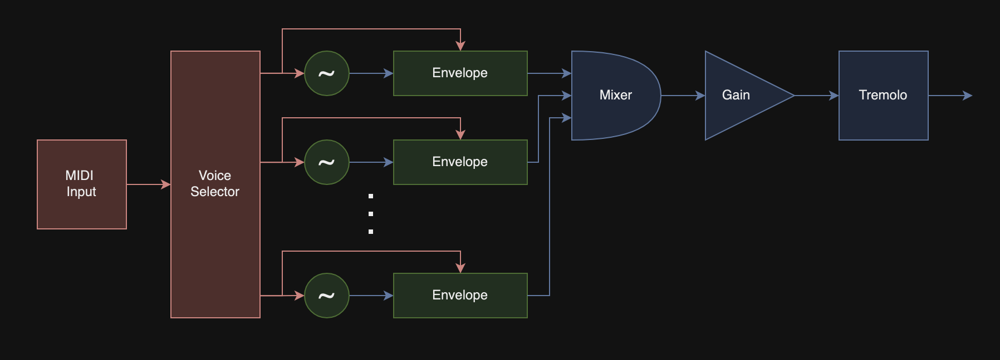

# dibiff

## Directed Audio Graphs
<ins>Digital Biquad Filters in Float</ins>

Multi-threaded real-time processing of audio graphs, using [Eigen](https://eigen.tuxfamily.org/index.php?title=Main_Page) for SIMD vector math, [miniaudio](https://miniaud.io/) for audio device interactions, and [rtmidi](https://www.music.mcgill.ca/~gary/rtmidi/) for MIDI device interactions.
#

# Building

To build, clone the repo and run CMake:

`mkdir build && cd build`

`cmake ..`

`make`

# Running & Testing 

To run the example, first make sure you have a MIDI device connected to your computer.

Then, run <ins>Baby's First Synth</ins>:

`./BabysFirstSynth`

If your MIDI device was not recognized by rtmidi, you'll see an error similar to this:
```
There are 0 MIDI input sources available.

MidiInCore::openPort: no MIDI input sources found!
```
Make sure it's plugged in and on.

If instead you see this:
```
There are 1 MIDI input sources available.
        Input Port #0: <DEVICE_NAME>
```
play some notes on your MIDI device, and you should hear the output from <ins>Baby's First Synth</ins>.

If your MIDI device input port is not 0, you'll need to change the port number in `test/BabysFirstSynthTest.cpp` and rebuild:
```
params.midiPortNum = <TARGET PORT NUMBER>;
```
Right now, the example file is set to control <ins>Baby's First Synth</ins>, which is a very basic polyphonic digital synthesizer:



The MIDI Input is fed directly to a voice selector, which will assign the MIDI note, velocity, and on/off status to an available voice to allow for polyphony. The Voice Selector sends MIDI information to target sine generator to change it's frequency, and also sends MIDI information to the target envelope to control the gating.

The output from each sine generator is dynamically adjusted by an envelope. Each envelope is currently set to the same parameters, but each can be controlled separately. The envelope has attack, decay, sustain, and release times to control the dynamics of the sine generators.

Each envelope output represents a voice, and each voice is mixed together using an equal-weighted mixer. A small amount of attenuation is applied to the mixer output.

This attenuated mixer output is then fed to a Tremolo effect, which uses a modulation depth and modulation rate to alter the output further.

Finally, the output from the tremolo is assigned to the output of <ins>Baby's First Synth</ins> so that it can be connected to other objects in the audio graph.

Once you're done, terminate the program with `Ctrl + C` or `^ + C`.

You can then find the output .wav files in the `build` folder.

# Usage
TODO: Building your own synth